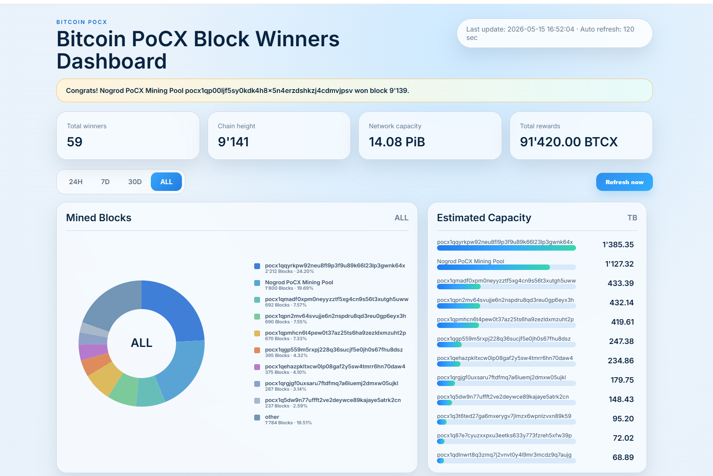
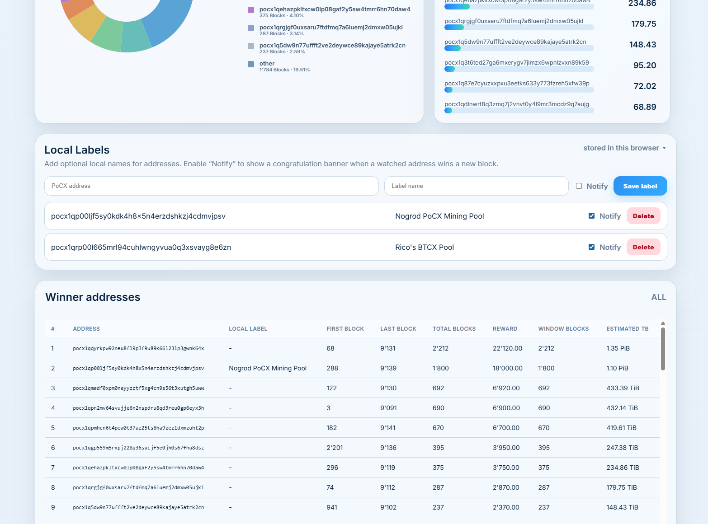
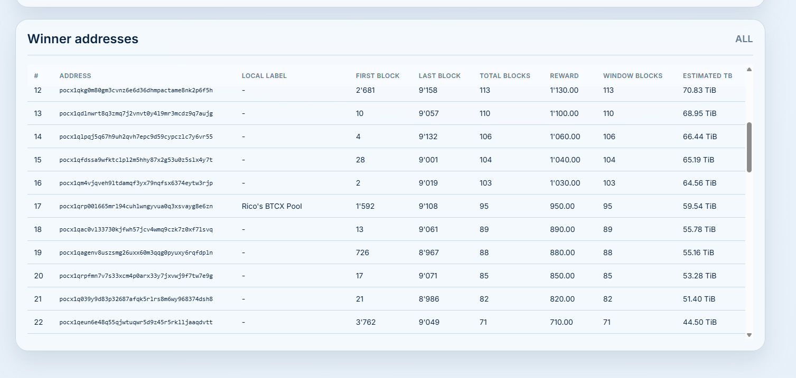

# PoCX Winners Dashboard

A lightweight self-hosted dashboard for Bitcoin PoCX block winner statistics.

It reads block headers from your local PoCX node through `bitcoin-cli`, stores winner history locally, and serves a clean web dashboard with mined block shares, estimated capacity, local browser labels, and optional block-win notifications for watched addresses.

## Dashboard Overview



---

## Local Labels



---

## Winner Addresses



## Features

- Fully local and self-hosted
- Uses your local PoCX node via `bitcoin-cli`
- No external API required
- Winner address statistics for 24H, 7D, 30D and ALL
- Network capacity card
- Estimated capacity calculation
- Local browser labels stored in `localStorage`
- Optional notify checkbox per local label
- Congratulation banner when a watched address wins a new block
- Auto-refresh every 120 seconds
- systemd service and cron scanner
- Raspberry Pi friendly

## Requirements

- Linux system with systemd
- Running Bitcoin PoCX node
- Working `bitcoin-cli`
- Python 3
- `jq`
- `flock` / util-linux

The installer installs the required Debian/Raspberry Pi OS packages automatically.

## Installation

Extract the release archive and enter the directory:

```bash
tar -xzf pocx-winners-dashboard-v1.4.tar.gz
cd pocx-winners-dashboard-v1.4
```

Create and edit the config:

```bash
cp pocx-winners.conf.example pocx-winners.conf
nano pocx-winners.conf
```

Example config:

```bash
BASE_DIR="$HOME/pocx-winners-dashboard"
BITCOIN_CLI="/home/<YOUR_USER>/bitcoin-pocx/bitcoin/build/bin/bitcoin-cli"
WEB_PORT="8082"
BLOCK_REWARD_BTCX="10"
SERVICE_NAME="pocx-winners-dashboard"
```

Install:

```bash
chmod +x install.sh
./install.sh --config ./pocx-winners.conf
```

Open the dashboard:

```text
http://<YOUR_NODE_IP>:8082/
```

## Firewall

If UFW is active, allow access from your local network:

```bash
sudo ufw allow from 192.168.1.0/24 to any port 8082 proto tcp
```

Adjust the subnet and port if needed.

## Data files

Generated files are stored below:

```text
$BASE_DIR/pocx_winners/
```

Important files:

```text
winners_raw.tsv        Raw block winner history
winners_summary.csv    Dashboard summary data
latest_blocks.json     Latest blocks for browser notifications
meta.json              Current metadata
last_height.txt        Last scanned height
```

## Scanner

The installer adds a cron job that runs every 2 minutes:

```cron
*/2 * * * * flock -n /tmp/pocx-winners-dashboard.lock env POCX_WINNERS_CONFIG=<config> <script> >/dev/null 2>&1
```

`flock` prevents parallel scans and duplicate counting.

## Service management

```bash
sudo systemctl status pocx-winners-dashboard
sudo systemctl restart pocx-winners-dashboard
sudo systemctl stop pocx-winners-dashboard
```

## Updating

For a future release, stop the service, copy the new files over the existing installation, run the scanner once, and restart the service.

## Uninstall

```bash
./uninstall.sh
```

This removes the systemd service and cron entry. Project files and generated data are kept.

## Local labels and notifications

Local labels are stored only in your browser. They are not written to the server.

When `Notify` is enabled for a local label, the dashboard checks the latest scanned blocks on refresh. If a watched address won a block, a banner is shown:

```text
Congrats! <label name> <pocx address> won block <blocknumber>.
```

## Notes about estimated capacity

Estimated capacity is based on mined block share in the selected time window and the observed PoCX difficulty. It is a statistical estimate and can fluctuate strongly for small miners or young chains.

## License

MIT License. See [LICENSE](LICENSE).
